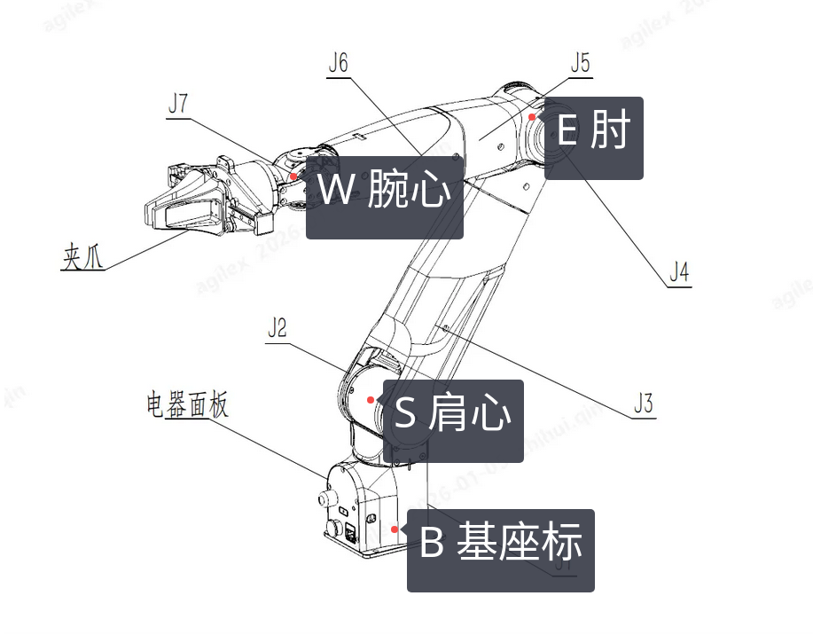

# 臂角 IK 完整教程

# Nero 臂角参数化 IK 完整教程

**参考清华论文《针对关节限位优化的7自由度机械臂逆运动学解法》**

- 论文链接: [https://jst.tsinghuajournals.com/article/2020/4286/20201206.htm](https://jst.tsinghuajournals.com/article/2020/4286/20201206.htm)
---

## 一、文档概述

本文档是 **NERO 7自由度机械臂臂角参数化逆运动学（IK）** 的完整教学文档。

内容大部分对应：

- 清华论文《针对关节限位优化的7自由度机械臂逆运动学解法》

- 实现 `ik_solver.py`

- ROS2 实时运行节点 `ik_joint_state_publisher.py`

---

# 二、算法核心背景与思想

## 2.1 7DoF 冗余机械臂的基本特性

7自由度机械臂（S-R-S 球面肩-旋转肘-球面腕）比 6DoF 多**一个冗余自由度**。

这意味着：

- 末端位姿固定时

- 关节角仍有无穷多组解

- 这组“末端不动、自身可动”的运动，称为**零空间运动**

冗余自由度带来三大能力：

1. 避关节限位

2. 避障

3. 肘部姿态优化

4. 轨迹更平滑

## 2.2 臂角参数化（论文核心）

论文的核心方法是：

**用一个参数表示全部冗余自由度 → 这个参数叫 臂角 ψ（代码中写作 theta0）**

### 臂角几何定义

末端位姿固定 → 肩点 S、腕点 W 固定。

肘点 E 会在空间中画出一个圆，这个圆所在平面的旋转角度，就是**臂角 ψ**。

- S：肩中心（前3轴交点）

- E：肘中心（第4轴位置）

- W：腕中心（后3轴交点）

- S–E–W 构成固定边长三角形

- 臂角 ψ 决定 E 在圆上的位置

一句话：

**ψ 变 → 肘部姿态变 → 关节角变 → 末端不变**

## 2.3 本方法与传统数值解法的区别

| 对比维度   | 数值迭代法（雅可比/阻尼最小二乘） | 臂角参数化解析法     |
| ---------- | --------------------------------- | -------------------- |
| 求解方式   | 迭代收敛，依赖初值                | 几何推导，闭式解     |
| 计算速度   | 慢（ms~10ms）                     | 极快（<0.1ms）       |
| 收敛性     | 可能不收敛、局部最优              | 全局最优、无发散     |
| 限位处理   | 被动约束、易超限                  | 主动可行域、永不超限 |
| 零空间控制 | 需投影算子、易抖                  | 直接控制 ψ、天然稳定 |
---

# 三、算法完整流程

整个算法分为 **4 个核心阶段**：

1. 从目标位姿提取 S、W、θ₄

2. 由臂角 ψ 计算肘点 E，解析求 q1q3、q5q7

3. 计算臂角可行域（满足所有关节限位）

4. 在可行域内用加权二次目标函数求最优臂角

下面逐段对应论文公式与代码。

---

# 3.1 步骤1：从目标位姿求 S、W、θ₄

## 论文原理

已知末端位姿 T07，反向求出：

- 肩点 S（基座固定点）

- 腕点 W（末端坐标系回退 d6 得到）

- 肘角 θ₄（由 S–E–W 三角形余弦定理唯一确定）

- 如图所示S，W，E，D点


余弦定理：

```Plain Text

cosθ₄ = ( |SW|² − |SE|² − |EW|² ) / ( 2·|SE|·|EW| )
```

## 代码实现：`_compute_swe_from_target`

```Python

def _compute_swe_from_target(T07: np.ndarray, p: NeroParams) -> Tuple[np.ndarray, np.ndarray, Optional[float], np.ndarray]:
    R = T07[:3, :3]
    p_target = T07[:3, 3]
    z7 = R[:, 2]
    d6 = float(p.d_i[6])
    d1 = float(p.d_i[0])

    # 末端法兰中心
    O7 = p_target - p.post_transform_d8 * z7
    # 腕心 W：从法兰再回退 d6
    W = O7 - d6 * z7
    # 肩心 S：固定在基座上方 d1
    S = np.array([0.0, 0.0, d1], dtype=float)

    # 余弦定理求 θ4 绝对值
    q4_abs = _solve_theta4_from_triangle(S, W, p)

    # 肩→腕单位向量
    v_sw = W - S
    n_sw = np.linalg.norm(v_sw)
    u_sw = v_sw / n_sw if n_sw > 1e-12 else np.array([0.0, 0.0, 1.0])

    return S, W, q4_abs, u_sw
```

## 辅助函数：`_solve_theta4_from_triangle`

```Python

def _solve_theta4_from_triangle(S: np.ndarray, W: np.ndarray, p: NeroParams) -> Optional[float]:
    l_sw = np.linalg.norm(W - S)
    l_se = abs(p.d_i[2])
    l_ew = abs(p.d_i[4])
    c4 = (l_sw**2 - l_se**2 - l_ew**2) / (2.0 * l_se * l_ew)
    c4 = np.clip(c4, -1.0, 1.0)
    return math.acos(c4)
```

**关键点**：

θ₄ 只和几何长度有关，**与臂角 ψ 无关**。

---

# 3.2 步骤2：由臂角 ψ 求肘点 E（核心几何）

## 论文原理

E 在以 SW 为弦的圆上：

```Plain Text

E = C + r · ( cosψ · e1 + sinψ · e2 )
```

- C：圆心

- r：圆半径

- e1, e2：圆平面正交基

## 代码实现：`_elbow_from_arm_angle`

```Python

def _elbow_from_arm_angle(S: np.ndarray, W: np.ndarray, theta0: float, p: NeroParams) -> Optional[np.ndarray]:
    l_se = abs(p.d_i[2])
    l_ew = abs(p.d_i[4])
    sw = W - S
    l_sw = np.linalg.norm(sw)
    u_sw = sw / l_sw

    # 圆心 C 在 SW 线上的投影
    x = (l_se**2 - l_ew**2 + l_sw**2) / (2.0 * l_sw)
    r2 = l_se**2 - x**2
    r = math.sqrt(max(0.0, r2))
    C = S + x * u_sw

    # 构造圆平面坐标系 e1, e2
    os_vec = S.copy()
    t = np.cross(os_vec, u_sw)
    e1 = t / np.linalg.norm(t)
    e2 = np.cross(u_sw, e1)
    e2 = e2 / np.linalg.norm(e2)

    # 由臂角 theta0 计算 E
    E = C + r * (math.cos(theta0) * e1 + math.sin(theta0) * e2)
    return E
```

**这是整个算法的几何灵魂**。

---

# 3.3 步骤3：由 S–E–W 解析求全部关节角

## 3.3.1 肩部 q1, q2, q3

论文通过几何投影直接给出闭式解：

- q1 由 E 在基座平面的投影得到

- q2 由 E 的高度得到

- q3 由腕相对于肘的方向得到

## 代码：`_solve_q123_from_swe`

```Python

def _solve_q123_from_swe(E: np.ndarray, W: np.ndarray, q4: float, p: NeroParams) -> List[np.ndarray]:
    d0 = p.d_i[0]
    d2 = p.d_i[2]
    d4 = p.d_i[4]
    Ex, Ey, Ez = E

    # q2
    c2 = (Ez - d0) / d2
    c2 = np.clip(c2, -1.0, 1.0)
    s2_abs = math.sqrt(max(0.0, 1.0 - c2**2))

    s4 = math.sin(q4)
    c4 = math.cos(q4)
    sols = []

    # 遍历 s2 正负两种构型
    for s2 in (s2_abs, -s2_abs):
        # q1
        c1 = -Ex / (d2 * s2)
        s1 = -Ey / (d2 * s2)
        n1 = math.hypot(c1, s1)
        c1 /= n1
        s1 /= n1
        q1 = math.atan2(s1, c1)
        q2 = math.atan2(s2, c2)

        # q3
        v = W - E
        col2 = -v / d4
        u1, u2, u3 = col2
        b1 = (s2 * c1 * c4 - u1) / s4
        b2 = (u2 - s1 * s2 * c4) / s4
        s3 = s1 * b1 + c1 * b2
        c2c3 = -c1 * b1 + s1 * b2
        c3 = c2c3 / c2 if abs(c2) > 1e-8 else (u3 + c2 * c4) / (s2 * s4)
        n3 = math.hypot(s3, c3)
        s3 /= n3
        c3 /= n3
        q3 = math.atan2(s3, c3)

        sols.append(np.array([q1, q2, q3]))
    return sols
```

## 3.3.2 腕部 q5, q6, q7

论文从变换矩阵 T47 中直接解析提取：

- cosθ₆ = T47[1,2]

- θ₅、θ₇ 由相邻项比值得到

## 代码：`_extract_567_from_T47_paper`

```Python

def _extract_567_from_T47_paper(T47: np.ndarray) -> List[np.ndarray]:
    sols = []
    c6 = np.clip(T47[1, 2], -1.0, 1.0)
    for sgn in (1.0, -1.0):
        s6 = sgn * math.sqrt(max(0.0, 1.0 - c6**2))
        if abs(s6) < 1e-8:
            continue
        th6 = math.atan2(s6, c6)
        th5 = math.atan2(T47[2, 2] / s6, T47[0, 2] / s6)
        th7 = math.atan2(T47[1, 1] / s6, -T47[1, 0] / s6)
        sols.append(np.array([th5, th6, th7]))
    return sols
```

---

# 3.4 步骤4：关节限位 → 臂角可行域

## 论文原理

每个关节的限位 [q_min, q_max] 都会对应一段**臂角不可用区间**。

所有关节的可用区间求交集 → 得到**臂角可行域 Ψ_F**。

只有在可行域内的臂角，才能让所有关节都不超限。

## 代码：`_get_theta0_feasible_region`

```Python

def _get_theta0_feasible_region(T07: np.ndarray, p: NeroParams, step: float = 0.01) -> List[float]:
    feasible = []
    for theta0 in np.arange(-math.pi, math.pi, step):
        if _ik_one_arm_angle(T07, theta0, p):
            feasible.append(float(theta0))
    return feasible
```

内部调用 `_ik_one_arm_angle`，该函数会：

- 代入臂角 ψ

- 求全套关节角

- 检查是否全部在限位内

- 是 → 加入可行域

---

# 3.5 步骤5：最优臂角选择（加权二次目标函数）

## 论文原理

目标函数：

```Plain Text

f(ψ) = Σ w_i · ( q_i(ψ) − q_i_prev )²
```

- w_i：关节越靠近限位，权重越大

- 目标：让关节运动最小，且远离限位

权重函数（论文式 20）：

```Plain Text

w(x) = (b x) / (e^{a(1−x)} − 1 ),  x≥0
w(x) = (−b x) / (e^{a(1+x)} − 1 ),  x<0
```

a=2.38，b=2.28

## 代码：`_weight_limits`

```Python

def _weight_limits(q: float, q_min: float, q_max: float) -> float:
    span = q_max - q_min
    x = 2.0 * (q - (q_min + q_max)*0.5) / span
    a = 2.38
    b = 2.28
    if x >= 0:
        den = math.exp(a*(1-x)) - 1
        return b*x / den
    else:
        den = math.exp(a*(1+x)) - 1
        return -b*x / den
```

## 最优臂角求解

```Python

def _optimal_theta0(feasible_theta0, T07, p, q_prev):
    best_cost = inf
    best_t = feasible_theta0[0]
    for t in feasible_theta0:
        sols = _ik_one_arm_angle(T07, t, p)
        for q_full in sols:
            q = q_full[:7]
            cost = 0
            for i in range(7):
                lo, hi = p.joint_limits[i]
                w = _weight_limits(q[i], lo, hi)
                dq = abs(q[i] - q_prev[i])
                cost += w * dq*dq
            if cost < best_cost:
                best_cost = cost
                best_t = t
    return best_t
```

**这就是论文的“最优选解”**。

本质是：

**一维二次函数最小化 → 全局最优 → 无迭代、无局部最优**。

---

# 四、零空间运动原理（天然自带）

7DoF 零空间 = 臂角 ψ 控制。

规则：

- 末端位姿 T07 **保持不变**

- 只改变臂角 ψ

- 关节自动做“末端不动、自身调整”的运动

这就是**零空间运动**。

代码中实现零空间只需要：

```Python

for psi in np.linspace(-pi, pi, 100):
    q = _q_from_theta0(psi, T07, p)
```

不需要雅可比、不需要投影、不会抖动。

---

# 五、代码结构总览（清晰版）

## [ik_solver.py](ik_solver.py) 核心函数清单

| 函数名                        | 功能         | 对应论文章节   |
| ----------------------------- | ------------ | -------------- |
| `_compute_swe_from_target`    | 求 S、W、θ₄  | 2.1 几何建模   |
| `_elbow_from_arm_angle`       | 臂角→肘点E   | 2.2 臂角参数化 |
| `_solve_q123_from_swe`        | 求肩部q1~q3  | 2.3 肩部闭式解 |
| `_extract_567_from_T47_paper` | 求腕部q5~q7  | 2.4 腕部闭式解 |
| `_get_theta0_feasible_region` | 臂角可行域   | 3.1 限位映射   |
| `_weight_limits`              | 动态权重     | 3.2 权重函数   |
| `_optimal_theta0`             | 最优臂角     | 3.3 二次优化   |
| `ik_arm_angle`                | IK 主接口    | 全文总结       |
| `solve_trajectory_continuous` | 连续轨迹平滑 | 工程扩展       |
---

# 六、快速使用方法

```Python

import numpy as np
from ik_solver import ik_arm_angle, NeroParams

# 目标位姿
T = np.eye(4)
T[:3, 3] = [0.5, 0, 0.5]

# IK 求解
q_best, feasible = ik_arm_angle(T)

print("最优关节角：", q_best)
print("可行臂角数量：", len(feasible))
```

---

# 七、总结

本算法是**7DoF S-R-S 机械臂的解析逆解 + 一维二次规划最优选解**，完全基于臂角参数化：

1. 几何闭式求解，无迭代、无优化、无雅可比

2. 自动满足关节限位

3. 最优性由二次函数保证

4. 天然支持零空间运动

5. 计算极快，适合实时控制
