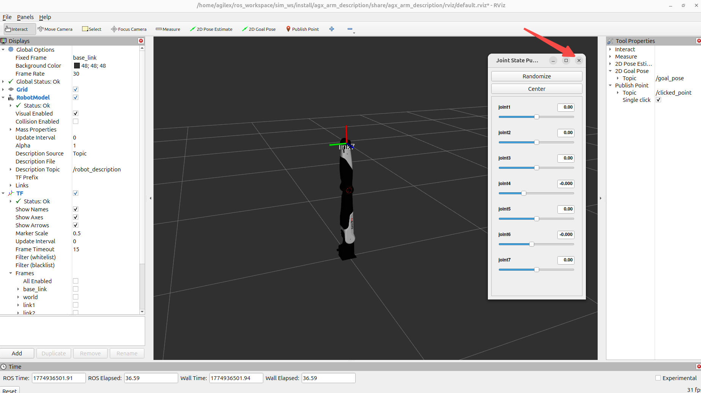
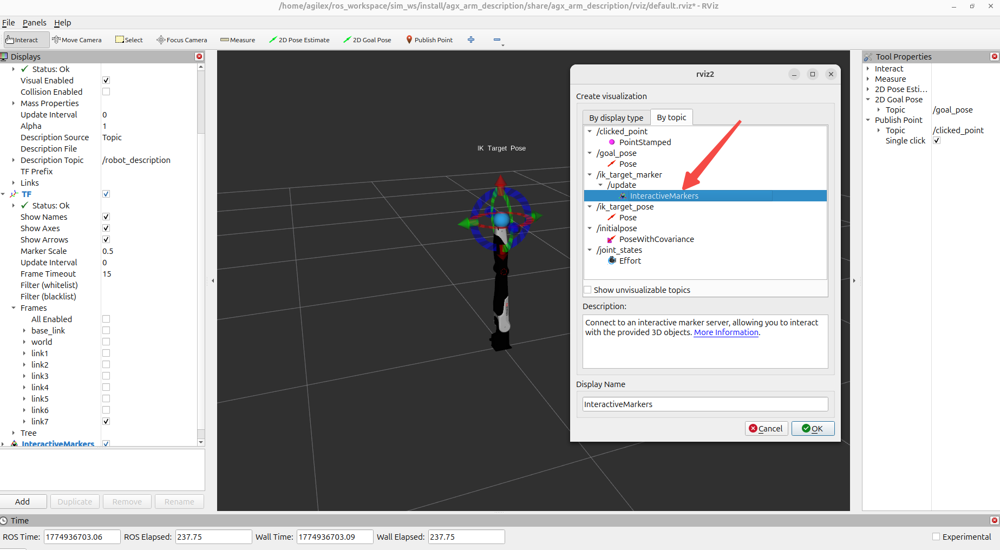

# 运行步骤

## 软件环境

- python3.12
- ROS2 jazzy

## 安装

- 编译agx_arm_sim

```bash
cd sim_ws

colcon build

source install/setup.sh
```

## 运行命令

- 启动RVIZ仿真可视化

```bash
source install/setup.sh

ros2 launch agx_arm_description display.launch.py arm_type:=nero
```

- 启动后关闭`joint state publisher gui`


- 启动ROS桥接
```bash
python nero_ik/ik_joint_state_publisher.py
```
- 在rviz中添加可视化Marker


- 启动交互式Maker
```bash
python interactive_target_marker.py
```

